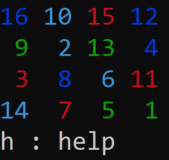
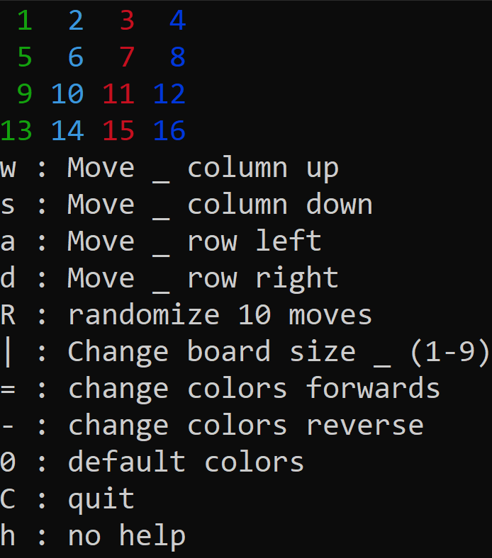
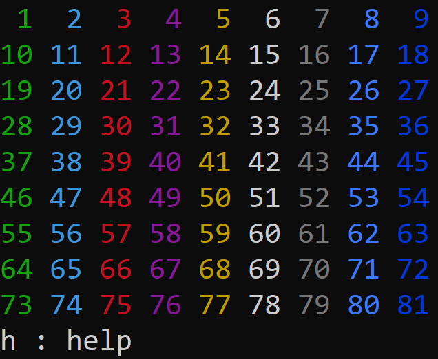
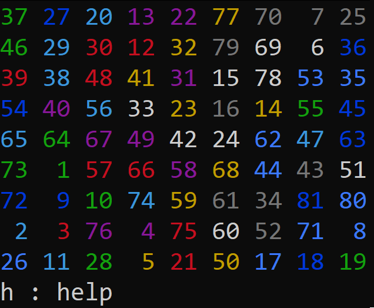

# 2DRubiks





# FAQ
* [What is 2DRubiks?](https://www.openprocessing.org/sketch/580366/)(Ctrl + click) the link
* Does this work on Linux?
    - Sadly no, due to libraries used in the code.
* Does this work on Windows
    - Yes, below instructions are provided.

# Install for windows
1. Download zip to Downloads
2. Unzip 2DRubiks-master
    * right-click & **extract here**
3. [gcc/g++ Compilers (used to compile and play)](https://iweb.dl.sourceforge.net/project/tdm-gcc/TDM-GCC%20Installer/tdm64-gcc-5.1.0-2.exe)(Ctrl + click) the link
    * run & install
    * Video on how to install the compilers [Compiler Installation Tutorial](https://youtu.be/w23QyVb1Jx4)(Ctrl + click) the link
    * If you have installed them once, you don't need to again
4. Press together: ```Win + R```
5. type & enter: ```cmd```
6. type & enter: ```cd Downloads``` to **c**hange **d**irectory to your Downloads
7. type & enter: ```cd 2DRubiks-master```
8. type & enter: ```g++ main.cpp -o run```
9. Read ```How to play``` before playing
10. type & enter: ```run```

# How to play :
1. **Controls**:
    * w : Move _ column up
    * s : Move _ column down
    * a : Move _ row left
    * d : Move _ row right
    * R : Randomize 10 moves
    * | : Change board size _ (1-9)
    * = : Change colors forwards
    * - : Change colors reverse
    * 0 : Default colors
    * C : Quit
    * h : No help
2. **Objective**:
    * Scramble with 'R' a few times
    * Solve back to original state